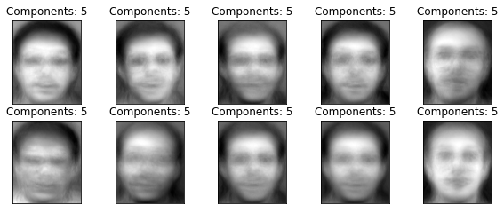
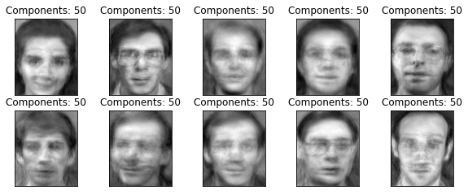
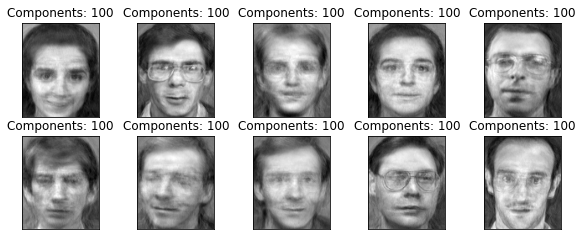
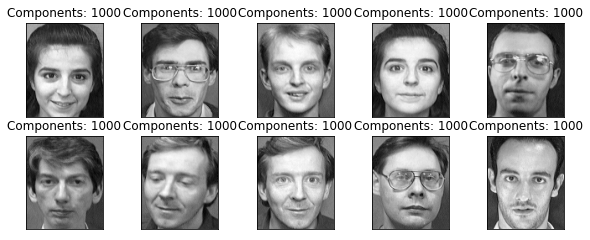
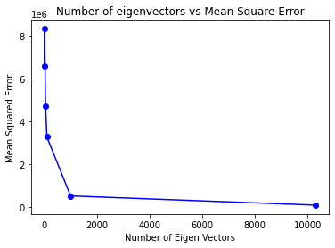
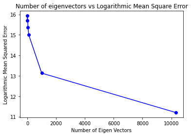

# Principal-Component-Analysis-from-Scratch

## Description

This repository contains a Jupyter Notebook that implements PCA (Principal Component Analysis) from scratch for facial recognition. It demonstrates the steps involved in PCA, including eigenface computation and accuracy comparisons for different components.

## What notebook has to offer?

The Jupyter Notebook provides an implementation of PCA for facial recognition. It starts by explaining the concepts behind PCA and its application in face recognition. Then, it guides you through the step-by-step process of implementing PCA from scratch. The notebook includes code examples and visualizations to help you understand the algorithm.

Key topics covered in the notebook include:

- Computing the covariance matrix
- Obtaining eigenfaces through eigenvector decomposition
- Reducing dimensionality and projecting face images onto the eigenface basis
- Comparing accuracies for different numbers of principal components

By following along with the notebook, you will gain a deeper understanding of PCA and its practical application in facial recognition.

## Dataset

The AT&T face dataset contains a set of grayscale face images with dimensions 92x112. The images are organized in 40 directories (one for each subject), which have names of the form sX, where X indicates the subject number (between 1 and 40). In each of these directories, there are ten different images of that subject, which have names of the form Y.pgm, where Y is the image number for that subject (between 1 and 10). These 10 images per person are taken at different times, varying the lighting, facial expressions (open / closed eyes, smiling / not smiling), and facial details (glasses / no glasses). All the images were taken against a dark homogeneous background with the subjects in an upright, frontal position (with tolerance for some side movement).

You can find the AT&T face dataset [here](https://git-disl.github.io/GTDLBench/datasets/att_face_dataset/).

## PCA for Facial Recognition

PCA is a dimensionality reduction technique commonly used in face recognition systems. It extracts the most significant features, called eigenfaces, from a set of face images. These eigenfaces capture the most distinguishing characteristics of the faces in the dataset. By projecting face images onto the eigenface basis, PCA reduces the dimensionality of the data and simplifies the recognition process.

The steps involved in PCA for facial recognition include:

1. Data collection and preprocessing
2. Computing the covariance matrix
3. Obtaining eigenvectors and eigenvalues
4. Selecting principal components (eigenfaces)
5. Reducing dimensionality and projecting face images
6. Comparing and evaluating recognition accuracies

The Jupyter Notebook in this repository demonstrates each step with detailed explanations and code snippets.

## Results

During the PCA process, one interesting observation is the relationship between the number of components (eigenfaces) and the clarity of the reconstructed faces. As we increase the number of components used to represent a face image, the eigenfaces become much more clear and visually recognizable. With a smaller number of components, the eigenfaces may appear more abstract and less defined. This highlights the importance of including an adequate number of components to accurately represent the facial features.

Additionally, the accuracy of the facial recognition algorithm also improves with an increased number of components. By incorporating more eigenfaces, the algorithm can capture more intricate facial details and variations, leading to better discrimination and recognition performance. It is essential to find a balance between the number of components and the computational complexity of the algorithm, as a higher number of components may require more computational resources.

In the Jupyter Notebook provided, you can observe and compare the reconstructed faces and recognition accuracies for different numbers of components. This will help you understand the impact of the number of components on the clarity of eigenfaces and the overall accuracy of the facial recognition system.

## Loss Plot with number of components

## Contribution

Any Contributions are most welcome. Feel free to play around the notebook and suggest changes.

